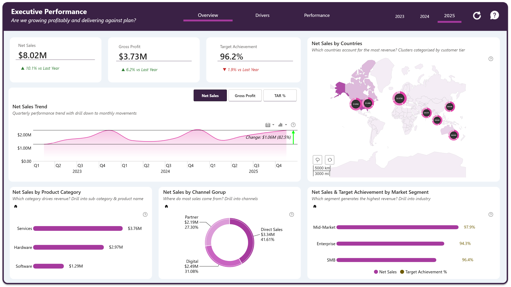
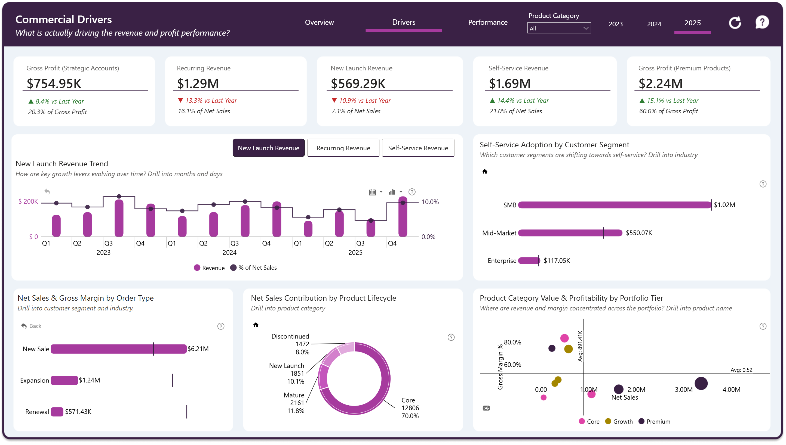
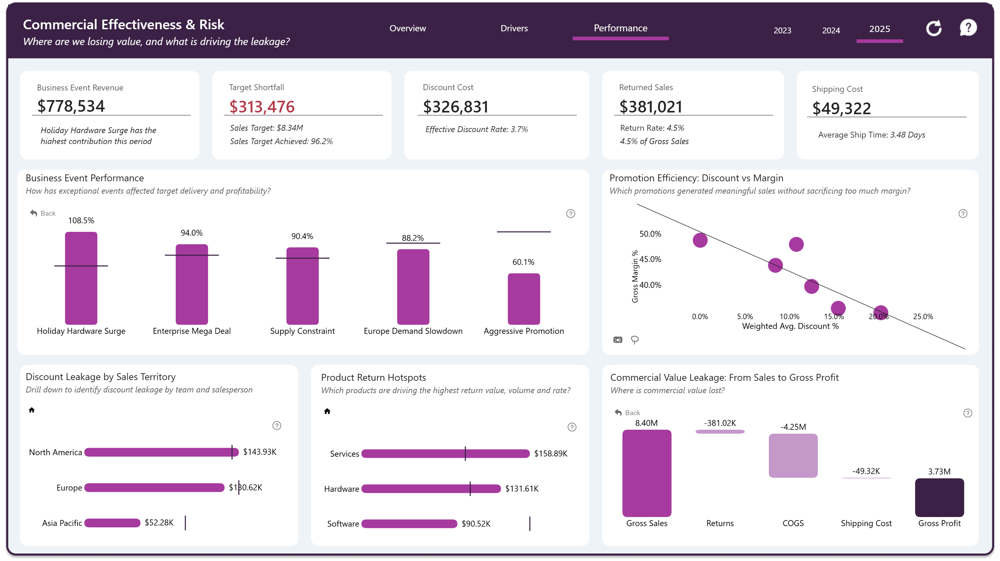

# B2B Sales Performance & Profitability Analytics

An executive Power BI solution analysing **6,000 B2B sales records from 2023 to 2025** across financial performance, strategic growth drivers, customer and product behaviour, promotions, returns, commercial risk and global markets.

The report is designed around three management questions:

**What happened? → What is driving it? → Where are we losing value and why?**

## Live Dashboard

[View the Interactive Power BI Report](https://app.powerbi.com/view?r=eyJrIjoiMjQwYWFiYzUtNzcxYi00YmMxLTkxYTYtNWIzM2ZkNWQwN2M5IiwidCI6IjQ2NTRiNmYxLTBlNDctNDU3OS1hOGExLTAyZmU5ZDk0M2M3YiIsImMiOjl9)

## Dataset

This project uses a synthetic challenge dataset created for analytical and portfolio demonstration purposes. It contains approximately **6,000 sales records** covering customers, products, sales teams, channels, promotions, targets, costs, returns, currencies and business events across **North America, Europe and Asia Pacific**.

The dataset contains no real client, employee, or confidential legal information.
All organisations, individuals, and case records represented in the project are fictional.

## Dashboard Preview

### Executive Performance

Tracks headline financial performance, profitability, target achievement, time trends, geographic contribution, product mix, channel mix, and market-segment performance.

### Commercial Drivers

Explores the strategic drivers behind performance, including strategic accounts, recurring revenue, new-launch revenue, self-service revenue, product lifecycle, customer order behaviour and portfolio profitability.

### Commercial Effectiveness & Risk

Investigates target shortfall, discount leakage, returned sales, shipping cost, promotion efficiency, business-event performance and the commercial value lost between gross sales and gross profit.

## Full Case Study

[Read the complete portfolio case study](documentation/Case_Study.pdf)

## Tools & Skills

**Power BI** • **DAX** • **Power Query** • **ZoomCharts** • **Star Schema Modelling** • **Data Quality Analysis** • **Data Storytelling** • **Dashboard UX Design**

